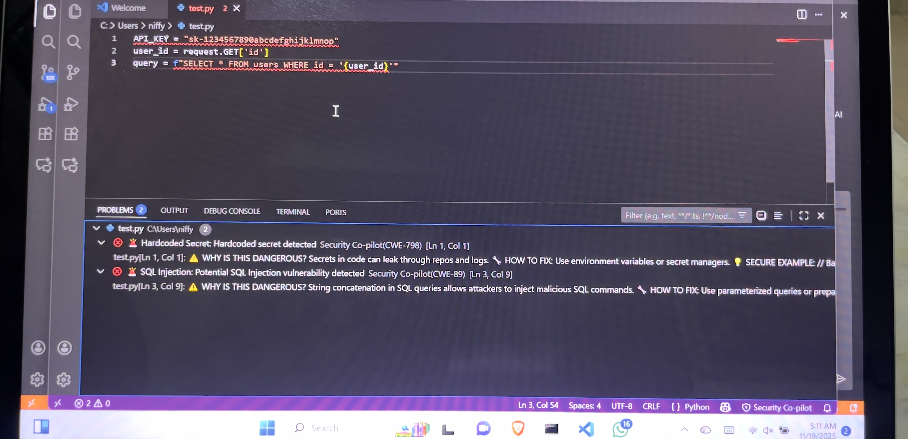

# 🛡️ Codeguard Copilot

<div align="center">


**Your AI-Powered Security Guardian for Writing Secure Code**

Catch vulnerabilities as you code - like Grammarly, but for security mistakes.

[Features](#-features) • [Installation](#-installation) • [Usage](#-usage) • [Demo](#-demo)

</div>

-----

## 🎯 What is Codeguard Copilot?

Codeguard Copilot is a VS Code extension that **proactively prevents security vulnerabilities** during development, not after. While GitHub Copilot helps you write code faster, Codeguard Copilot ensures that code is secure from the start.

Unlike traditional security scanners that run after you commit, Codeguard Copilot:

- ✅ **Catches mistakes in real-time** as you type
- ✅ **Explains risks in plain English** so you learn security principles
- ✅ **Suggests secure alternatives** with one-click fixes
- ✅ **Educates developers** instead of just flagging issues
- ✅ **Integrates seamlessly** into your coding workflow

Think of it as **“Grammarly for secure code”** - your personal security co-pilot that helps you write safer code from day one.

-----

## ✨ Features

### 🔍 **Real-Time Vulnerability Detection**

- Scans code as you write - instant feedback
- Detects 20+ vulnerability types including SQL injection, XSS, hardcoded secrets
- Pattern-based detection (fast, <10ms response)
- Multi-language support: JavaScript, TypeScript, Python, Java, PHP

### 🤖 **AI-Powered Deep Analysis**

- Context-aware security analysis using Claude, GPT-4, or Groq
- Identifies logic flaws and business logic vulnerabilities
- Framework-specific security recommendations
- Smart detection of complex security patterns

### 📚 **Educational Security Insights**

- **“Why is this dangerous?”** - Clear explanations of security risks
- **“How attackers exploit this”** - Real-world attack scenarios
- **“The secure way to do this”** - Concrete fixes with code examples
- CWE references linked to MITRE documentation

### 🔧 **Smart Quick Fixes**

- One-click secure code replacements
- Inline suggestions as you code
- Framework-aware best practice recommendations
- Automated remediation where possible

### ⚡ **Performance Optimized**

- Debounced scanning (configurable delay)
- Incremental analysis for large files
- Workspace-wide scanning with progress tracking
- Status bar integration for quick access

-----

## 📥 Installation

### From Source (For Now)

1. **Clone the repository:**

```bash
git clone https://github.com/inboxBodyguard/codeguard-copilot.git
cd codeguard-copilot
```

1. **Install dependencies:**

```bash
npm install
```

1. **Compile the extension:**

```bash
npm run compile
```

1. **Launch in VS Code:**

- Open the project in VS Code
- Press `F5` to start debugging
- A new Extension Development Host window will open

### Configuration

1. Open VS Code Settings (`Ctrl+,` or `Cmd+,`)
1. Search for “Codeguard Copilot”
1. Configure your preferences:

```json
{
  "codeguardCopilot.enableRealtime": true,
  "codeguardCopilot.scanDelay": 500,
  "codeguardCopilot.aiProvider": "anthropic",
  "codeguardCopilot.apiKey": "your-api-key-here",
  "codeguardCopilot.enableAI": true
}
```

**🔑 Get API Keys:**

- [Anthropic Claude](https://console.anthropic.com/)
- [OpenAI GPT-4](https://platform.openai.com/)
- [Groq](https://console.groq.com/)

-----

## 🚀 Usage

### Basic Usage

Codeguard Copilot works automatically once activated. Just start coding!

**Keyboard Shortcuts:**

- `Ctrl+Shift+S` (Mac: `Cmd+Shift+S`) - Scan current file
- `Ctrl+Shift+M` - Open Problems panel to view vulnerabilities

**Commands** (via Command Palette `Ctrl+Shift+P`):

- `Codeguard Copilot: Scan Current File`
- `Codeguard Copilot: Scan Entire Workspace`
- `Codeguard Copilot: Explain This Vulnerability`

### Example: SQL Injection Detection

**Vulnerable Code:**

```python
# ❌ DANGEROUS: This code is vulnerable
user_input = request.GET['search']
query = f"SELECT * FROM users WHERE name = '{user_input}'"
cursor.execute(query)
```

**What Codeguard Copilot Shows:**

```
🚨 SQL Injection: Potential SQL Injection vulnerability detected

⚠️ WHY IS THIS DANGEROUS?
String concatenation in SQL queries allows attackers to inject malicious 
SQL commands. An attacker could read, modify, or delete your entire database.

🔧 HOW TO FIX:
Use parameterized queries or prepared statements. Never concatenate user 
input directly into SQL.

💡 SECURE EXAMPLE:
cursor.execute("SELECT * FROM users WHERE name = %s", (user_input,))

📚 REFERENCE: CWE-89
Learn more: https://cwe.mitre.org/data/definitions/89.html
```

### Example: Hardcoded Secrets Detection

**Vulnerable Code:**

```javascript
// ❌ DANGEROUS: Secrets in code
const API_KEY = "sk-1234567890abcdefghijklmnop";
const PASSWORD = "admin123";
```

**Codeguard Copilot Alert:**

```
🚨 Hardcoded Secret: Hardcoded secret detected (CWE-798)

Secrets in source code can be exposed through version control, logs, 
or decompilation. Attackers can use these to compromise your systems.

🔧 FIX: Store secrets in environment variables
const API_KEY = process.env.API_KEY;
```

-----

## 🎯 Detected Vulnerabilities

Codeguard Copilot detects **20+ vulnerability types** across multiple categories:

### 🔴 **Critical Severity**

- **SQL Injection** (CWE-89) - String concatenation in database queries
- **Command Injection** (CWE-78) - Unsanitized input in system commands
- **Hardcoded Secrets** (CWE-798) - API keys, passwords in source code
- **Insecure Deserialization** (CWE-502) - Unsafe pickle/YAML operations
- **NoSQL Injection** (CWE-943) - MongoDB query injection

### 🟠 **High Severity**

- **Cross-Site Scripting (XSS)** (CWE-79) - innerHTML, dangerouslySetInnerHTML
- **Path Traversal** (CWE-22) - User-controlled file paths
- **Arbitrary File Upload** (CWE-434) - Unrestricted file uploads
- **Weak Cryptography** (CWE-327) - MD5, SHA1, DES usage
- **DOM-based XSS** - document.location manipulation

### 🟡 **Medium Severity**

- **CORS Misconfiguration** (CWE-942) - Overly permissive origins
- **Open Redirect** (CWE-601) - Unvalidated redirects
- **Insecure Random** (CWE-338) - Math.random() for security
- **ReDoS** (CWE-1333) - Regular expression denial of service
- **Missing Security Headers** - CSP, HSTS, X-Frame-Options

### 🟢 **Low Severity**

- **Weak Password Storage** - Unhashed or weakly hashed passwords
- **Express Trust Proxy** - Improper proxy configuration
- **Framework-specific issues** - React, Node.js anti-patterns

[View Full Vulnerability Database →](src/patterns/vulnerabilityPatterns.ts)

-----

## 📸 Screenshots

<!-- TODO: Add actual screenshots here -->

### Real-Time Vulnerability Detection


*Codeguard Copilot catches vulnerabilities as you type*

### Educational Explanations


*Learn why code is vulnerable and how to fix it*

### Quick Fix Suggestions


*Apply secure code patterns with one click*

### Status Bar Integration


*Quick access to security scanning from the status bar*

-----

## ⚙️ Configuration

All settings can be configured in VS Code Settings:

|Setting                          |Type   |Default      |Description                                     |
|---------------------------------|-------|-------------|------------------------------------------------|
|`codeguardCopilot.enableRealtime`|boolean|`true`       |Enable real-time scanning as you type           |
|`codeguardCopilot.scanDelay`     |number |`500`        |Delay in ms before scanning after typing stops  |
|`codeguardCopilot.aiProvider`    |string |`"anthropic"`|AI provider: `anthropic`, `groq`, or `openai`   |
|`codeguardCopilot.apiKey`        |string |`""`         |API key for AI provider (use workspace settings)|
|`codeguardCopilot.enableAI`      |boolean|`true`       |Enable AI-powered deep analysis                 |
|`codeguardCopilot.severityFilter`|array  |`all`        |Which severity levels to show                   |

### Example Configuration

```json
{
  "codeguardCopilot.enableRealtime": true,
  "codeguardCopilot.scanDelay": 500,
  "codeguardCopilot.aiProvider": "anthropic",
  "codeguardCopilot.enableAI": true,
  "codeguardCopilot.severityFilter": ["critical", "high", "medium"]
}
```

**⚠️ Important:** Store your API key in workspace settings (`.vscode/settings.json`), not in your user settings, and **never commit it to git**.

-----

## 🏗️ Architecture

```
codeguard-copilot/
├── src/
│   ├── extension.ts              # Entry point, VS Code integration
│   ├── patterns/
│   │   ├── securityScanner.ts    # Pattern-based vulnerability detection
│   │   └── vulnerabilityPatterns.ts  # Database of 20+ vulnerability patterns
│   ├── ai/
│   │   └── aiEngine.ts           # AI provider integration (Claude/GPT/Groq)
│   └── ui/
│       ├── diagnostics.ts        # VS Code diagnostics rendering
│       └── quickFix.ts           # Quick fix suggestions & actions
├── package.json                   # Extension manifest
├── tsconfig.json                  # TypeScript configuration
└── README.md                      # You are here!
```

### How It Works

1. **Pattern Matching Layer** (Fast, <10ms)
- Regex-based detection for known vulnerability patterns
- Immediate feedback as you type
- Language-specific rule matching
1. **AI Analysis Layer** (Smart, ~2-5s)
- Triggered for complex code or critical vulnerabilities
- Context-aware security analysis
- Framework-specific recommendations
- Identifies logic flaws that patterns can’t catch
1. **VS Code Integration**
- Diagnostics API for inline warnings
- Quick fixes for automated remediation
- Webview panels for detailed explanations
- Status bar for quick access

-----

## 🤝 Contributing

Contributions are welcome! Whether you want to add new vulnerability patterns, improve AI prompts, or enhance the UI, we’d love your help.

### How to Contribute

1. **Fork the repository**
1. **Create a feature branch** (`git checkout -b feature/amazing-feature`)
1. **Make your changes**
1. **Test thoroughly** (add vulnerable code samples to test)
1. **Commit your changes** (`git commit -m 'Add amazing feature'`)
1. **Push to the branch** (`git push origin feature/amazing-feature`)
1. **Open a Pull Request**

### Adding Custom Vulnerability Patterns

Edit `src/patterns/vulnerabilityPatterns.ts` and add your pattern:

```typescript
{
  type: 'Your Vulnerability Name',
  severity: 'critical' | 'high' | 'medium' | 'low',
  regex: /your-pattern-here/gi,
  languages: ['javascript', 'python'],
  message: 'Short description',
  explanation: 'Why this is dangerous',
  fix: 'How to fix it',
  codeExample: 'Secure code example',
  cwe: 'CWE-XXX'
}
```

### Development Setup

```bash
# Clone and install
git clone https://github.com/inboxBodyguard/codeguard-copilot.git
cd codeguard-copilot
npm install

# Compile TypeScript
npm run compile

# Watch mode (auto-recompile on changes)
npm run watch

# Debug in VS Code
# Press F5 to launch Extension Development Host
```

-----

## 📊 Roadmap

- [ ] Support for more languages (Go, Rust, C++, C#, Ruby)
- [ ] Custom rule configuration via `.codeguard.json`
- [ ] Integration with SAST tools (Snyk, Semgrep)
- [ ] Team collaboration features (shared rule sets)
- [ ] Security training mode for learning
- [ ] JetBrains IDE support
- [ ] CI/CD integration for automated scanning
- [ ] VS Code Marketplace publication
- [ ] Telemetry dashboard for security metrics
- [ ] Plugin system for custom analyzers

-----

## 📝 License

This project is licensed under the **MIT License** - see the <LICENSE> file for details.

-----

## 🙏 Acknowledgments

- **OWASP** for security vulnerability classifications
- **CWE/MITRE** for vulnerability documentation
- **Anthropic, OpenAI, and Groq** for AI models
- **VS Code Team** for the excellent extension API
- The amazing developer community for feedback and contributions

-----

## 📧 Contact & Support

- **Issues:** [GitHub Issues](https://github.com/inboxBodyguard/codeguard-copilot/issues)
- **Discussions:** [GitHub Discussions](https://github.com/inboxBodyguard/codeguard-copilot/discussions)
- **Email:** Ezmcyber@zohomail.com
- **Twitter:** [@yourhandle](https://twitter.com/niffy_hunt)

-----

<div align="center">

**⭐ If Codeguard Copilot helped you write more secure code, give it a star!**

Made with ❤️ for secure coding

[⬆ Back to Top](#-codeguard-copilot)

</div>